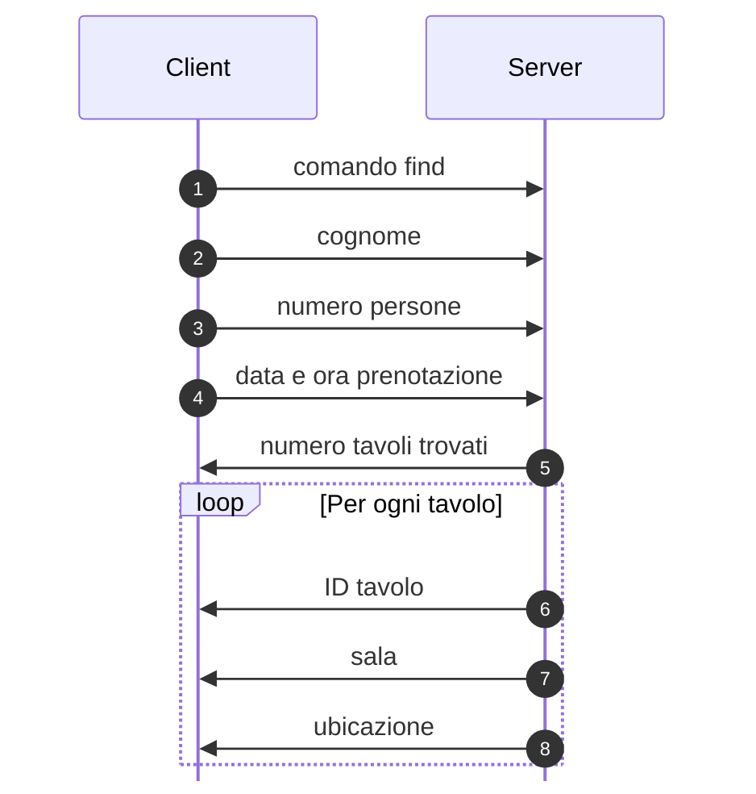
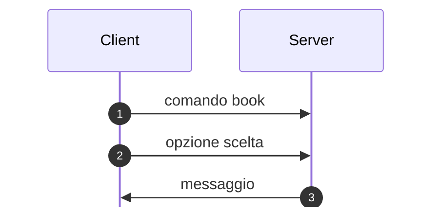
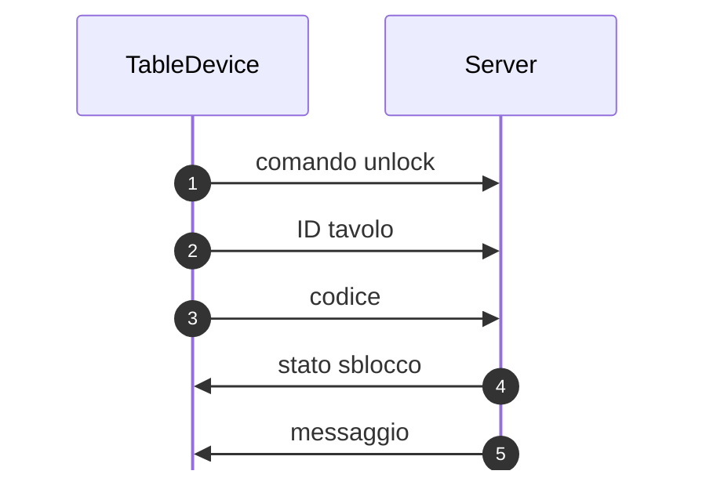
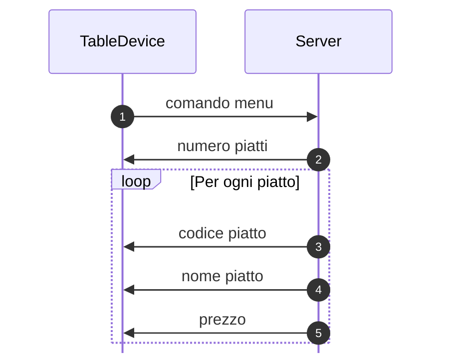
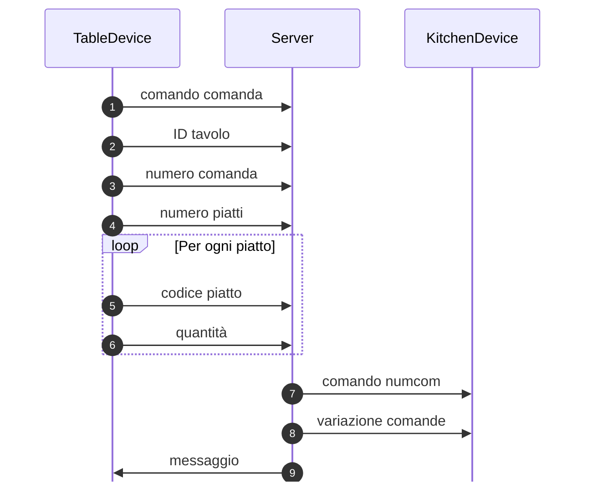
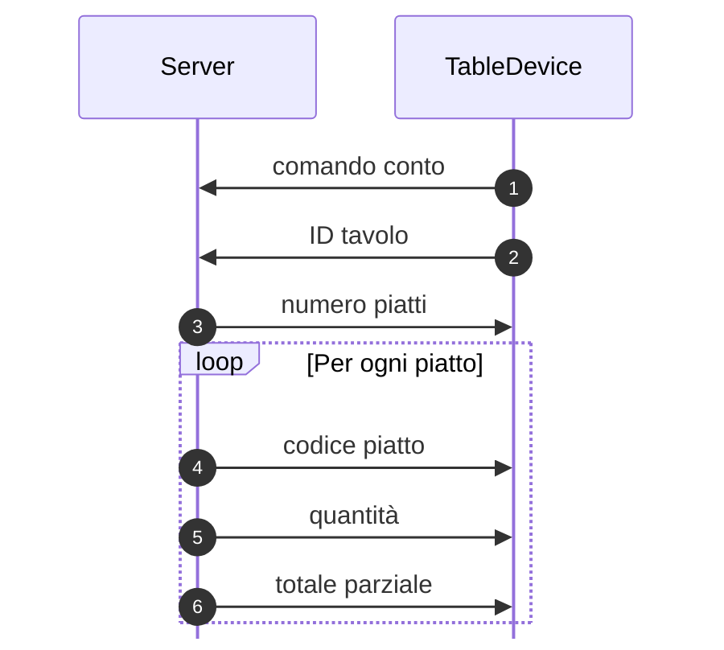
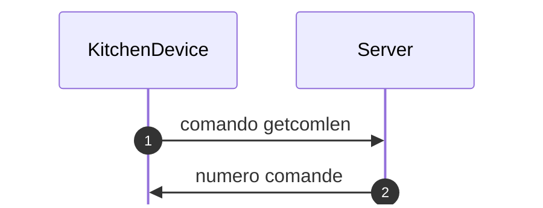
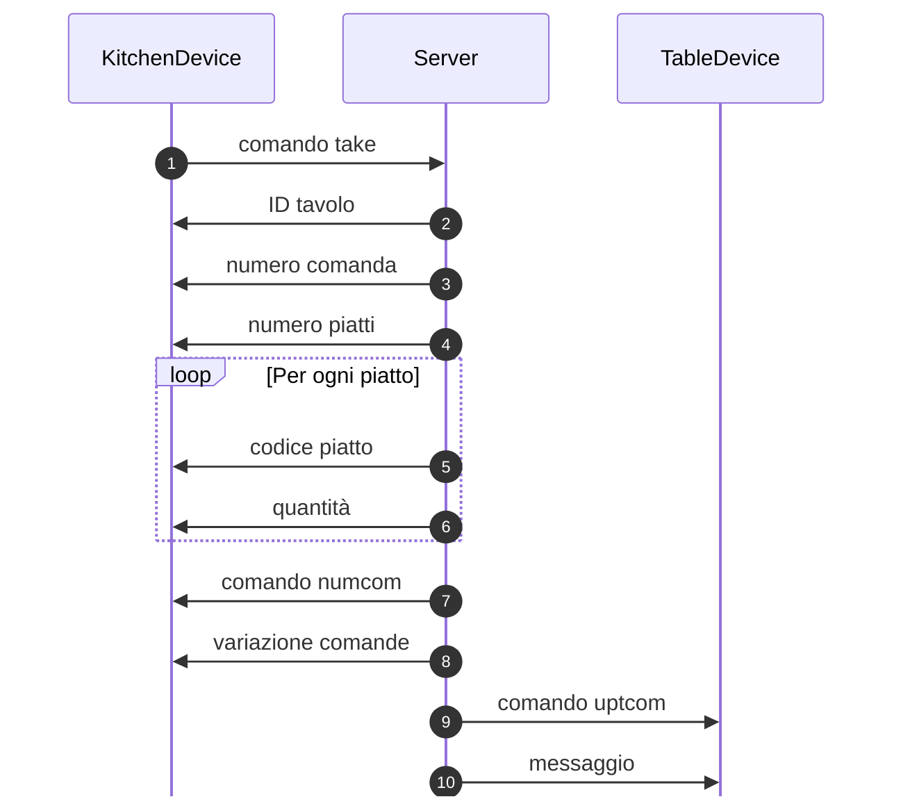
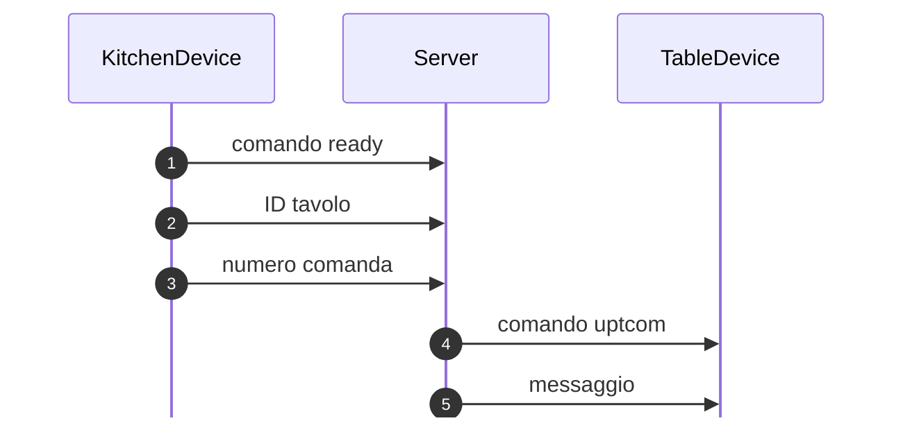

# RistorazioneDigitale

Applicazione distribuita basata sul paradigma client-server che implementa un 
sistema di prenotazione tavoli e gestione delle comande di un ristorante.

Il progetto contiene 5 cartelle: 
- 4 contengono i file per la logica di ogni dispositivo, e sono rispettivamente `Client`, `Server`, `TableDevice`, `KitchenDevice`
- La cartella `utils` contiene la logica e le costanti utilizzate da tutti i file del progetto

Ogni traferimento di dati tra i dispositivi avviene utilizzando il _binary protocol_, ogni informazione è definita e strutturata, e il numero di byte è prefissato.

Ogni volta che c'è uno scambio di informazioni tra dispositivo e server, o viceversa, viene prima inviato un comando che definisce l'operazione da svolgere e poi i rispettivi dati da trasmettere.

## Server

Il **Server** è il componente centrale del sistema. Gestisce le connessioni dei dispositivi e le comande. Il sever è multi-threaded e gestisce le connessioni dei dispositivi in modo asincrono. Ogni thread gestisce un socket, relativo ad un dispositivo, e rimane in ascolto per ricevere comandi fino alla chiusura del socket o allo spegniento del server.

## Client
Il **Client** serve a inviare le prenotazioni al **Server**.
I comandi che vengono inviati al server sono:
- [`find`](#comando-find) per cercare i tavoli disponibili
- [`book`](#comando-book) per prenotare un tavolo

### Comando find

Invia una richiesta di disponibilità dove la data è espressa in formato GG-MM-AA e l’ora come HH.
Il server risponde con un elenco di opzioni di tavoli disponibili.

| Op. | Tipo | N Byte |
|:---:|:-----|:-------|
| 1 | `cmd` | 20 |
| 2 | `prenotazione::cognome` | 255 |
| 3 | `prenotazione::n_persone` | 2 |
| 4 | `prenotazione::datetime` | 4 |
| 5 | `len` | 4 |
| 6 | `tavolo::id` | 4 |
| 7 | `tavolo::sala` | 4 |
| 8 | `tavolo::ubicazione` | 255 |

### Comando book

Invia una richiesta di prenotazione di un tavolo corrispondente all'opzione scelta. Il server risponde con un messaggio di conferma, contenente tutte le informazioni della prenotazione (nome, data, ora, tavolo e codice di sblocco), o di errore.

| Op. | Tipo | N Byte |
|:---:|:-----|:-------|
| 1 | `cmd` | 20 |
| 2 | `len` | 4 |
| 3 | `response` | 2048 |

## TableDevice

Il **TableDevice** serve a ordinare i piatti tramite le comande.
I comandi che vengono inviati al server sono:
- [`getid`](#comando-getid) per ottenere l'ID del tavolo
- [`unlock`](#comando-unlock) per sbloccare il tavolo
- [`menu`](#comando-menu) per ottenere il menu
- [`comanda`](#comando-comanda) per inviare la comanda
- [`conto`](#comando-conto) per richiedere il conto
  
> NOTA: Il TableDevice utilizza 2 socket per la comunicazione con il Server, uno per lo scambio di informazioni e uno per la ricezione delle notifiche; Il secondo viene memorizzato dal server insieme all'accettazione del comando `getid`. Le notifiche che riceve il TableDevice riguardano il cambio di stato delle comande inviate.

### Comando getid

Richiede al server l'ID del tavolo. Gli ID sono assegnati dal server in modo dinamico e non possono essere duplicati.

| Op. | Tipo | N Byte |
|:---:|:-----|:-------|
| 1 | `cmd` | 20 |
| 2 | `tavolo_id` | 4 |

### Comando unlock

Convalida il codice di sblocco del tavolo inserito dall'utente.

| Op. | Tipo | N Byte |
|:---:|:-----|:-------|
| 1 | `cmd` | 20 |
| 2 | `tavolo_id` | 4 |
| 3 | `unlock_code` | 4 |
| 4 | `uint8_t` | 1 |
| 5 | `response` | 2048 |

### Comando menu

Richiede al server il menu.

| Op. | Tipo | N Byte |
|:---:|:-----|:-------|
| 1 | `cmd` | 20 |
| 2 | `len` | 4 |
| 3 | `piatto::code` | 3 |
| 4 | `piatto::nome` | 255 |
| 5 | `piatto::prezzo` | 4 |

### Comando comanda

Invia al server la comanda contenente il tipo di piatto e la quantità.

| Op. | Tipo | N Byte |
|:---:|:-----|:-------|
| 1 | `cmd` | 20 |
| 2 | `tavolo_id` | 4 |
| 3 | `num_com` | 2 |
| 4 | `len` | 4 |
| 5 | `type` | 3 |
| 6 | `len` | 4 |
| 7 | `cmd` | 20 |
| 8 | `len` | 4 |
| 9 | `response` | 2048 |

### Comando conto

Richiede al server il conto. Il conto può essere richiesto se c'è stata almeno una comanda inviata e se tutte le comande sono state servite

| Op. | Tipo | N Byte |
|:---:|:-----|:-------|
| 1 | `cmd` | 20 |
| 2 | `tavolo_id` | 4 |
| 3 | `len` | 4 |
| 4 | `type` | 3 |
| 5 | `len` | 4 |
| 6 | `valore` | 4 |

## KitchenDevice

Il **KitchenDevice** serve a gestire le comande. Le comande vengono prese in carico, preparate e servite.
I comandi che vengono inviati al server sono:
- [`getcomlen`](#comando-getcomlen) per ottenere il numero di comande in attesa
- [`take`](#comando-take) per prendere in carico una comanda in attesa da più tempo
- [`ready`](#comando-ready) per segnalare che la comanda è pronta

> NOTA: Il KitchenDevice utilizza 2 socket per la comunicazione con il Server, uno per lo scambio di informazioni e uno per la ricezione delle notifiche; il secondo viene memorizzato dal server insieme all'accettazione del comando `getcomlen`.

### Comando getcomlen

Richiede al server il numero di comande in attesa.

| Op. | Tipo | N Byte |
|:---:|:-----|:-------|
| 1 | `cmd` | 20 |
| 2 | `len` | 4 |

### Comando take

Prende in carico una comanda in attesa da più tempo. 

> NOTA: Le operazioni 7 e 8 sono eseguite verso ogni KitchenDevice connesso al server e non solo verso il KitchenDevice che ha inviato il comando `take`. \
> Mentre le operazioni 9 e 10 sono eseguite solo verso il TableDevice di riferimento della comanda.

| Op. | Tipo | N Byte |
|:---:|:-----|:-------|
| 1 | `cmd` | 20 |
| 2 | `tavolo_id` | 4 |
| 3 | `num_com` | 2 |
| 4 | `len` | 4 |
| 5 | `type` | 3 |
| 6 | `len` | 4 |
| 7 | `cmd` | 20 |
| 8 | `len` | 4 |
| 9 | `cmd` | 20 |
| 10 | `response` | 2048 |

### Comando ready

Segnala al server che la comanda è pronta. Il server poi provvederà a notificare il tavolo relativo alla comanda.

| Op. | Tipo | N Byte |
|:---:|:-----|:-------|
| 1 | `cmd` | 20 |
| 2 | `tavolo_id` | 4 |
| 3 | `num_com` | 2 |
| 4 | `cmd` | 20 |
| 5 | `response` | 2048 |

