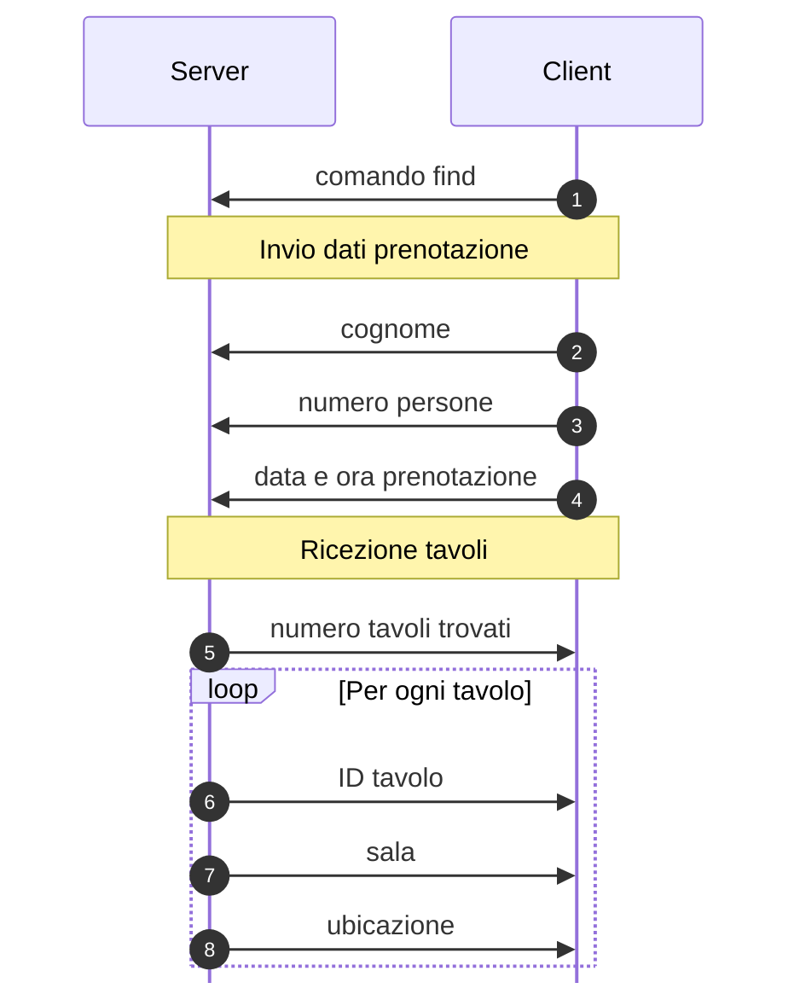
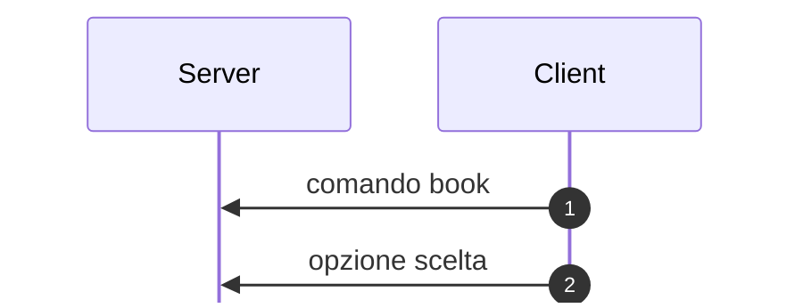

# RistorazioneDigitale

Applicazione distribuita basata sul paradigma client-server che implementa un 
sistema di prenotazione tavoli e gestione delle comande di un ristorante.

Il progetto contiene 5 cartelle: 
- 4 contengono i file per la logica di ogni dispositivo, e sono rispettivamente `Client`, `Server`, `TableDevice`, `KitchenDevice`
- La cartella `utils` contiene la logica e le costanti utilizzate da tutti i file del progetto

Ogni traferimento di dati tra i dispositivi avviene utilizzando il _binary protocol_, ogni informazione è definita e strutturata, e il numero di byte è prefissato.

Ogni volta che c'è uno scambio di informazioni tra dispositivo e server, o viceversa, viene prima inviato un comando che definisce l'operazione da svolgere e poi i rispettivi dati da trasmettere.

## Client
Il **Client** serve a inviare le prenotazioni al **Server**.
I comandi che vengono inviati al server sono:
- [`find`](#comando-find) per cercare i tavoli disponibili
- [`book`](#comando-book) per prenotare un tavolo

### Comando find

Invia una richiesta di disponibilità dove la data è espressa in formato GG-MM-AA e l’ora come HH.
Il server risponde con un elenco di opzioni di tavoli disponibili.

| Op. | Tipo | N Byte |
|:---:|:-----|:-------|
| 1 | `cmd` | 20 |
| 2 | `prenotazione::cognome` | 255 |
| 3 | `prenotazione::n_persone` | 2 |
| 4 | `prenotazione::datetime` | 4 |
| 5 | `len` | 4 |
| 6 | `tavolo::id` | 4 |
| 7 | `tavolo::sala` | 4 |
| 8 | `tavolo::ubicazione` | 255 |

### Comando book

Invia una richiesta di prenotazione di un tavolo corrispondente all'opzione scelta.

| Op. | Tipo | N Byte |
|:---:|:-----|:-------|
| 1 | `cmd` | 20 |
| 2 | `len` | 4 |

