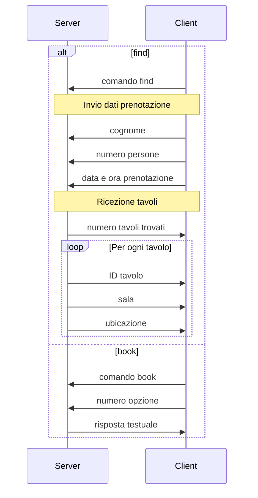

# RistorazioneDigitale

## Client

```mermaid
sequenceDiagram
	participant sv as Server
	participant cl as Client
	alt find
		cl->>sv: comando find
		Note over sv,cl: Invio dati prenotazione
		cl->>sv: cognome
		cl->>sv: numero persone
		cl->>sv: data e ora prenotazione
		Note over sv,cl: Ricezione tavoli
		sv->>cl: numero tavoli trovati
		loop Per ogni tavolo
			sv->>cl: ID tavolo
			sv->>cl: sala
			sv->>cl: ubicazione
		end
	else book
		cl->>sv: comando book
		cl->>sv: numero opzione
		sv->>cl: risposta testuale

	end

```
